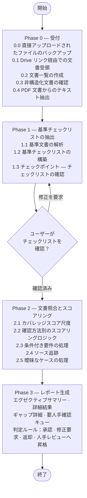

# document-validator

[English (en)](README.md) | [繁體中文 (zh-TW)](README.zh-TW.md) | [简体中文 (zh-CN)](README.zh-CN.md) | [日本語 (ja)](README.ja.md) | [한국어 (ko)](README.ko.md)

## 概要

`document-validator` は文書適合性検証エージェント（agent）です。**基準文書**（要件を定義する文書——法令、入札仕様書、審査委員会の意見、社内チェックリストなど）と**対象文書**（検証される文書——申請書、提案書、事業計画書など）を与えると、基準文書のすべての要件が対象文書で満たされているかを体系的に検証します。

このエージェントは単純なキーワード一致では動作しません。基準文書から構造化されたチェックリストを構築し、対象文書に対して各要件を評価し、何が満たされているか、何が部分的か、何が欠落しているかを明示した審査レポートを生成します——レビュアーが全ページを読まなくても即座に対応できるようにします。

---

## 設計思想とロジック



### Phase 0 — 受付
エージェントは提供されたすべての文書を一覧化し、レポート全体で追跡できるよう短い ID を割り当てます（例：基準文書は `C-1`、`C-2`、対象文書は `P-1`、`P-2`、`P-3`）。文書が非構造化または画像主体の場合、エージェントはその旨を通知し、ベストエフォートで抽出を続行します。

チャットに直接貼り付けるには大きすぎる文書は、代わりに Google Drive リンクで提供できます（例：「これが対象文書です：https://drive.google.com/file/d/.../view」）。エージェントは [`skill/scripts/fetch_drive_file.py`](skill/scripts/fetch_drive_file.py) を使って Google Drive API を直接呼び出します——チャットクライアントの connector を必要としないため、このスキルが別の環境（例：Google Agent Engine）にデプロイされたエージェントとして動作する場合でも機能します。認証には Application Default Credentials を使用し、Google ネイティブ文書（Docs/Sheets/Slides）はまず PDF にエクスポートしてすべての文書が同じページ引用規則に従うようにし、プレーンテキスト/Markdown ファイルは内容を直接読み込み、フォルダリンクは中の各ファイルを一覧の個別エントリに展開します。対象ファイルは、その認証情報が解決する ID（例：デプロイ先の service account）に共有されている必要があります——「リンクを知っている全員がアクセス可能」という公開共有は不要で、機密性の高い行政文書では通常使うべきではありません。

PDF 入力に対しては、エージェントは [`skill/scripts/extract_pdf_text.py`](skill/scripts/extract_pdf_text.py) を使って各ページを Markdown に変換します——引用のためにページ番号を保持し、表を雑然としたテキストではなく実際の Markdown 表として表現し、スキャン/画像主体と思われるページにフラグを立てます。検出された画像は記録されますが内容は抽出されないため、レビュアーは元の PDF で図表を確認する必要があることがわかります。処理に時間がかかりすぎるページ（大きな埋め込み画像）やベクター図形が密集しているページ（CAD/3D 図面）は、抽出全体を停止させるのではなくフラグが立てられます。大きな PDF は一度にまとめて読み込むのではなくページ範囲ごとのチャンクで取得されるため、100 ページを超える基準文書も一度に全部読み込む必要はありません。

### Phase 1 — 基準チェックリストの抽出
エージェントは基準文書を解析し、すべての要件を抽出して以下のように分類します：

| 種類 | 説明 |
|------|------|
| **失格要件 (Disqualifying)** | いずれか一つでも満たされない場合は即座に返却 |
| **必須要件 (Mandatory)** | 無条件に存在し、満たされていなければならない |
| **条件付き要件 (Conditional)** | 特定の発生条件が当てはまる場合にのみ必須 |
| **推奨要件 (Advisory)** | 推奨だが必須ではない；記録のみでスコアリングしない |

基準文書が多層構造（章 → 条 → 項）を持つ場合、各要件の ID はドット表記でその階層を反映します——`REQ-1`、`REQ-1.2`、`REQ-1.2.3`——ID だけで基準文書内の位置がわかり、別途確認する必要がありません。

次のステップに進む前にチェックポイントが提示されます——ユーザーはチェックリストを確認するか、欠落している要件を追加するよう依頼できます。ユーザーが変更を依頼した場合、エージェントはまず何を変更したかを説明し、更新後の完全なチェックリストを再提示して確認を求めてから次に進みます。

### Phase 2 — 文書照合とスコアリング
各要件は適切な確認方法（フィールドの有無、キーワード一致、数値/形式の適合性、論理的整合性）を用いて対象文書全体に対してスコアリングされます。曖昧なケースでは、エージェントは関連する文章を引用し、自身の解釈を明示し、必要に応じてその項目を要人手確認としてフラグします。

カバレッジスコア：

| スコア | ラベル | 意味 |
|------|------|------|
| 90–100% | ✅ 適合 | 明確に対応済み；内容が完全 |
| 70–89% | ⚠️ 部分適合 | 記載はあるが不完全または曖昧 |
| 40–69% | ❌ 弱い | 間接的にしか関連しない、または明らかに不十分 |
| 0–39% | 🚫 欠落 | 対応する内容が見つからない |
| — | 🔍 判定不能 | 利用可能な唯一の証拠が、実際には読み取られなかった内容（画像、スキャンページ、技術図面、またはタイムアウトしたページ）である |

ページが画像、スキャン、または読み取れない状態であることは、その内容が適合していることの証拠にはなりません——それは「証拠の不存在」であり、「証拠の存在」ではありません。エージェントは、誰も実際に読んでいない内容に基づいて「適合」（または他のスコア付きラベル）と判定することは絶対にありません；このような場合は常に「判定不能」と評価し、要人手確認キューに送り、レビュアーが何を確認すべきかを明示します（例：「9 ページ目——図面、内容未抽出；必要な敷地配置図が含まれているか確認してください」）。スコアと「要人手確認フラグ」が矛盾することは絶対にありません——フラグが立てられている場合、スコアは必ず「判定不能」であり、自信に満ちたように見えるパーセンテージにはなりません。

### Phase 3 — レポート生成
エージェントは現在の会話で使用されている言語で構造化されたレポートを生成します（分析対象の文書自体の言語とは必ずしも一致しません）。内容は以下の通りです：

- **エグゼクティブサマリー** — 全体の適合率と判定の推奨
- **詳細結果表** — 要件ごとに 1 行、スコア・出典・備考を含む
- **ギャップ詳細** — 90% 未満のすべての項目に加え、すべての「判定不能」項目をカバーし、根本原因ごとにまとめて修正案を付記
- **要人手確認キュー** — 結論を出す前に人間の判断が必要な項目。誰も実際に読んでいない内容のみで支えられている項目も含む

判定オプション：*承認* / *修正要求* / *返却* / *人手レビューへ昇格*

---

## 使い方

**ステップ 1** — 何を検証したいかを説明し、文書を提供します——PDF は Google Drive リンク（または直接アップロード）、プレーンテキスト/Markdown はメッセージに直接貼り付けます。基準は法令である必要はありません；いくつかの例：

### シナリオ：補助金/助成金申請の審査

> このアプリケーションパッケージを検証してください：
>
> 基準文書：
> - subsidy-program-guidelines.pdf — https://drive.google.com/file/d/1AbCdEfGhIjKlMnOpQrStUvWxYz/view
> - application-format-requirements.md
>
> 対象文書：
> - application-form-main.pdf — https://drive.google.com/file/d/1QwErTyUiOpAsDfGhJkLzXcVbNm/view
> - attachment-1-financial-statement.pdf — https://drive.google.com/file/d/1ZxCvBnMqWeRtYuIoPaSdFgHjKl/view
> - attachment-2-project-proposal.pdf — https://drive.google.com/file/d/1MnBvCxZaQwErTyUiOpLkJhGfDs/view

### シナリオ：入札文書の審査

> このベンダーの提案書が当社の入札仕様書のすべての必須要件を満たしているか確認してください：
>
> 基準文書：
> - tender-notice.pdf — https://drive.google.com/file/d/1TenderSpecAbCdEfGhIjKlMnOp/view
>
> 対象文書：
> - vendor-proposal.pdf — https://drive.google.com/file/d/1VendorBidAbCdEfGhIjKlMnOp/view

### シナリオ：審査委員会の意見反映確認

> 審査委員会の意見と請負業者が明言した約束事項に対してこの事業計画書を確認してください——約束した内容がすべて計画書に明確に反映されていることを確認してください。
>
> https://drive.google.com/file/d/1AbCdEfGhIjKlMnOpQrStUvWxYz/view

いずれのシナリオでも、エージェントはまず文書を一覧化し、スコアリングを始める前に基準チェックリストをあなたと確認します（上記 Phase 1 のチェックポイントを参照）。

**ステップ 2** — 検証レポートを受け取ります。上記の補助金/助成金シナリオの例：

> **文書検証レポート**
>
> 対象文書：application-form-main.pdf（+2 件の添付）
> 基準：subsidy-program-guidelines.pdf（+1 件の補助文書）
> 審査日：2026-06-18
>
> **エグゼクティブサマリー**
>
> 全体適合率：72%
> - ✅ 適合：11 項目
> - ⚠️ 部分適合：3 項目
> - ❌ 弱い：1 項目
> - 🚫 欠落：3 項目
>
> 判定：修正要求
>
> **詳細結果 — 必須要件**
>
> | ID | 要件 | 結果 | スコア | 出典 | 備考 |
> |----|------|------|------|------|------|
> | REQ-1 | 申請者の本人確認済み | ✅ | 98% | [P-1] §1.1 | |
> | REQ-2 | 事業目的の記載あり | ✅ | 95% | [P-1] §2.3 | |
> | REQ-3.1.1 | 予算明細の提供 | ⚠️ | 74% | [P-3] p.4 | 支出区分が欠落 |
> | REQ-4.1 | 財務諸表添付済み | ✅ | 100% | [P-2] | |
> | REQ-4.2 | 宣誓書添付 | 🚫 | 0% | — | いずれの対象文書にも見つからない |
> | REQ-4.3 | 同意書添付 | 🚫 | 0% | — | いずれの対象文書にも見つからない |
>
> **詳細結果 — 条件付き要件**
>
> | ID | 要件 | 発生条件は該当？ | 結果 | スコア | 出典 | 備考 |
> |----|------|----------------|------|------|------|------|
> | REQ-5 | 環境影響評価書 | はい | ⚠️ | 78% | [P-3] §5 | 概要のみ；完全な評価書は未添付 |
> | REQ-6 | 共同申請者の委任状 | いいえ | ➖ 該当なし | — | — | |
>
> **ギャップ詳細**
>
> REQ-4.2、REQ-4.3：宣誓書と同意書がいずれの対象文書にも見つかりません
> - 欠落内容：両文書とも対象文書に存在しない
> - 基準の根拠：[C-1] 第 4 条 第 2、3 項
> - 不備の種類：修正可能
> - 修正案：両文書を添付して再提出
>
> REQ-3.1.1：事業計画書に必要な予算明細が含まれていません
> - 欠落内容：支出区分が記載されていない
> - 証拠の出典：[P-3] p.4（部分的）
> - 基準の根拠：[C-2] 付録 1
> - 不備の種類：修正可能
> - 修正案：[C-2] 付録 1 に従って項目別予算表を追加

---

## プロジェクト構成

```
document-validator/
├── agent/                  # ADK wrapper — skill/SKILL.md をシステムプロンプトとして読み込む
│   ├── __init__.py         # ADK ローダー用に root_agent をエクスポート
│   ├── agent.py            # LlmAgent の構築
│   ├── drive_tool.py       # fetch_drive_file_oauth — ユーザー個人の OAuth による Drive アクセス（デプロイ環境専用）
│   ├── skill_loader.py     # SKILL.md フロントマターのパーサー
│   └── tools.py            # start_job/check_job（バックグラウンドスクリプト実行）と read_asset
├── skill/                  # スキル本体 — エージェントの動作を定義する場所
│   ├── SKILL.md            # 各フェーズ、要件の種類、レポート形式、実行ガイドライン
│   └── scripts/
│       ├── extract_pdf_text.py   # PDF → Markdown、start_job/check_job 経由で起動
│       ├── fetch_drive_file.py   # Google Drive API での取得（service account/ADC）、start_job/check_job 経由で起動
│       └── gcs_state.py          # 他に永続化手段のないファイル/状態を GCS にバックアップ
├── tests/                  # Wrapper の単体テスト（エージェント構築、ツール実行）
│   └── eval/                     # 振る舞いレベルの評価（下記「評価」参照）— pytest ではない
│       ├── datasets/basic-dataset.json  # 評価ケース — 基準とその場で生成された対象文書テキスト
│       └── eval_config.yaml             # カスタムメトリクス：判定の正確性など
├── agents-cli-manifest.yaml  # `agents-cli`（評価/開発ループツール）が agent/ を見つけるために使用
├── deploy.sh               # Google Cloud Agent Runtime（Agent Engine）へデプロイ
├── .env.example            # デプロイ前に .env にコピーして値を入力
├── requirements.txt        # ランタイム依存関係。デプロイされるコンテナにインストールされる
└── pyproject.toml          # ローカル開発依存関係とテスト設定
```

このリポジトリは完全でデプロイ可能なエージェントです：[`agent/`](agent/) wrapper は薄い ADK ローダー（[agent-skill-wrapper](https://agentskills.io/specification) ベース）で、[`skill/SKILL.md`](skill/SKILL.md) をエージェントのシステムプロンプトに変換し、その `scripts/` を呼び出し可能なツールとして公開します。`agent/` 内のものは文書検証に固有のものではありません——エージェントの動作を変更するには `skill/SKILL.md` を編集すべきであり、wrapper のコードではありません。唯一の例外は [`drive_tool.py`](agent/drive_tool.py) です：これは OAuth 同意フローを動かすために ADK の `ToolContext` を必要としますが、これは正規の ADK FunctionTool にのみ存在し、`start_job`/`check_job` で呼び出されるサブプロセススクリプトには存在しません。`GOOGLE_OAUTH_CLIENT_ID` が設定されている場合にのみ登録されます（下記「デプロイ」を参照）；そうでない場合、エージェントは `fetch_drive_file.py` にフォールバックします。

## 評価

`tests/test_*.py` は wrapper の機構のみを検査します（`start_job` が実際にスクリプトを実行するか、パストラバーサルが拒否されるかなど）——LLM の出力は本質的に非決定的であり、この種の pytest アサーションは本質的に不安定なため、エージェントが実際に下す判断をアサートすることは決してありません。コンプライアンス/ギャップ分析のロジック自体が「正しい」かどうか——正しい判定、正しく特定されたギャップ——は、[`google-agents-cli`](https://pypi.org/project/google-agents-cli/) の評価ツールで別途検証されます：

```bash
agents-cli eval generate   # tests/eval/datasets/basic-dataset.json に対して実際のエージェントを実行
agents-cli eval grade      # tests/eval/eval_config.yaml のメトリクスに基づいてこれらのトレースを採点
```

`gcloud auth application-default login` と `GOOGLE_CLOUD_PROJECT`（`--project` で上書き可能）が必要です——これは実際の Gemini モデルを呼び出します。最初から用意されている 3 つのケースは、承認、必須要件の欠落、失格条件のケースをそれぞれカバーします；スキルが成長するにつれて `tests/eval/datasets/` の下に追加してください。データセットのスキーマ、メトリクスの作成方法、失敗ケースに基づく反復のワークフローについては、`agents-cli eval --help` と `google-agents-cli-eval` スキルを参照してください。

## デプロイ

**1. 設定：**

```bash
cp .env.example .env
```

`.env` を編集します — 最低限 `GOOGLE_CLOUD_PROJECT` と `STAGING_BUCKET` を設定してください。基準文書や対象文書の PDF が大きい場合は `AGENT_MEMORY`（デフォルト `8Gi`）を増やしてください——メモリが不足するとコンテナはエラーログを残さず黙って OOM-killed されます。

**2. デプロイ：**

```bash
./deploy.sh
# または .env を編集せずに project/region を上書き：
./deploy.sh <project-id> <region>
```

これによりローカルの仮想環境が作成され、`requirements.txt` がインストールされ、Google Cloud Agent Runtime（旧称 Vertex AI Agent Engine）にデプロイされます。最初の実行後に再デプロイすると、新しいインスタンスを作成するのではなく、同じインスタンス（`.env` の `AGENT_ENGINE_ID` で追跡）が更新されます。

**3. Gemini Enterprise に登録**（オプション）：`deploy.sh` の出力の最後に表示される Reasoning Engine Resource ID に従って、Gemini Enterprise 管理コンソールでカスタムエージェントとして接続してください。

**実運用前に必ず確認すること：** デフォルトの Google Drive 取得経路では、デプロイされた service account がレビュアーがリンクする予定のファイルに実際にアクセス権を持っている必要があります——上記 Phase 0 の注記を参照してください。ファイルは service account のメールアドレスに共有してください；「リンクを知っている全員がアクセス可能」という共有は不要であり、機密性の高い行政文書では通常使うべきではありません。

**オプション — service account の代わりにユーザー個人として Drive にアクセス：** `.env` で `GOOGLE_OAUTH_CLIENT_ID`/`GOOGLE_OAUTH_CLIENT_SECRET`（`.env.example` 参照）を設定すると `agent/drive_tool.py` が有効になります。これを設定すると、エージェントは Gemini Enterprise でサインインしているユーザーとして Drive にアクセスします——そのユーザー自身のファイルは通常通りそのユーザーに共有されていればよく、service account への個別共有は不要です。Google Cloud Console → APIs & Services → Credentials で OAuth クライアント（種類は「ウェブ アプリケーション」、Drive API を有効化、同意画面のスコープは `drive.readonly`）を作成してください。両方とも空のままにすると、この機能はスキップされ、上記の service account 経路が使用されます。

Agent Engine のコンテナインスタンスは一時的なものであり、同じ会話のターン間で入れ替わることがあります。ローカルディスクのみに保存されたファイル（直接アップロードや抽出状態）はこれを乗り越えられません。`scripts/gcs_state.py` は他に永続化手段のないもの（SKILL.md §0.0 と §1 を参照）を `document-validator-sessions-{GOOGLE_CLOUD_PROJECT}` という名前の GCS バケットにバックアップします。デプロイ前に一度作成し、デプロイされた service account に書き込み権限を付与してください：

```bash
gsutil mb gs://document-validator-sessions-your-project-id
gsutil iam ch serviceAccount:your-deployed-sa@your-project-id.iam.gserviceaccount.com:roles/storage.objectAdmin gs://document-validator-sessions-your-project-id
```

### ローカル開発

```bash
pip install -e ".[dev]"
pytest -v
```
