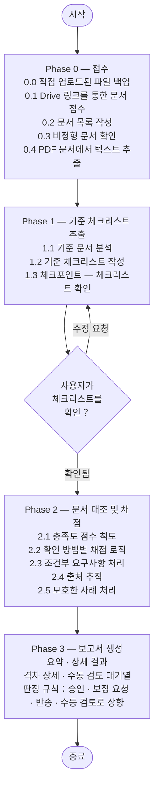

# document-validator

[English (en)](README.md) | [繁體中文 (zh-TW)](README.zh-TW.md) | [简体中文 (zh-CN)](README.zh-CN.md) | [日本語 (ja)](README.ja.md) | [한국어 (ko)](README.ko.md)

## 개요

`document-validator`는 문서 적합성 검증 에이전트(agent)입니다. **기준 문서**(요구사항을 정의하는 문서 — 법규, 입찰 규격서, 심사위원회 의견, 내부 체크리스트 등)와 **검토 대상 문서**(검토받는 문서 — 신청서, 제안서, 사업계획서 등)가 주어지면, 기준 문서의 모든 요구사항이 검토 대상 문서에서 충족되는지 체계적으로 확인합니다.

이 에이전트는 단순 키워드 매칭으로 동작하지 않습니다. 기준 문서로부터 구조화된 체크리스트를 구성하고, 검토 대상 문서를 기준으로 각 요구사항을 평가하여, 무엇이 충족되었는지, 무엇이 부분적인지, 무엇이 누락되었는지를 명확히 보여주는 심사 보고서를 생성합니다 — 검토자가 모든 페이지를 직접 읽지 않고도 즉시 조치를 취할 수 있도록 합니다.

---

## 설계 철학과 로직



### Phase 0 — 접수
에이전트는 제공된 모든 문서를 목록화하고, 보고서 전체에서 추적할 수 있도록 짧은 ID를 부여합니다(예: 기준 문서는 `C-1`, `C-2`; 검토 대상 문서는 `P-1`, `P-2`, `P-3`). 문서가 비정형이거나 이미지 위주인 경우, 에이전트는 이를 알리고 최선을 다해 추출을 진행합니다.

채팅에 직접 붙여넣기에는 너무 큰 문서는 대신 Google Drive 링크로 제공할 수 있습니다(예: "이것이 검토 대상 문서입니다: https://drive.google.com/file/d/.../view"). 에이전트는 [`skill/scripts/fetch_drive_file.py`](skill/scripts/fetch_drive_file.py)를 통해 Google Drive API를 직접 호출합니다 — 채팅 클라이언트의 connector가 필요 없으므로, 이 스킬이 다른 환경(예: Google Agent Engine)에 배포된 에이전트로 실행될 때도 동작합니다. 인증에는 Application Default Credentials를 사용하며, Google 네이티브 문서(Docs/Sheets/Slides)는 먼저 PDF로 내보내 모든 문서가 동일한 페이지 인용 규칙을 따르도록 하고, 일반 텍스트/Markdown 파일은 내용을 바로 읽어들이며, 폴더 링크는 그 안의 각 파일을 목록의 개별 항목으로 펼칩니다. 대상 파일은 해당 자격 증명이 가리키는 신원(예: 배포된 service account)에 공유되어 있어야 합니다 — "링크를 아는 누구나 접근 가능"한 공개 공유는 필요하지 않으며, 민감한 행정 문서에는 보통 사용하지 않아야 합니다.

PDF 입력의 경우, 에이전트는 [`skill/scripts/extract_pdf_text.py`](skill/scripts/extract_pdf_text.py)를 사용해 각 페이지를 Markdown으로 변환합니다 — 인용을 위해 페이지 번호를 보존하고, 표를 뒤섞인 텍스트가 아닌 실제 Markdown 표로 표현하며, 스캔/이미지 위주로 보이는 페이지에 표시를 남깁니다. 감지된 이미지는 기록되지만 내용이 추출되지는 않으므로, 검토자는 원본 PDF에서 도표를 확인해야 함을 알 수 있습니다. 처리 시간이 너무 오래 걸리는 페이지(큰 삽입 이미지)나 벡터 그래픽이 밀집된 페이지(CAD/3D 도면)는 전체 추출 과정을 멈추게 하는 대신 표시됩니다. 큰 PDF는 한 번에 전부 읽어들이는 대신 페이지 범위 단위로 청크 처리되므로, 100페이지가 넘는 기준 문서도 한 번에 모두 로드할 필요가 없습니다.

### Phase 1 — 기준 체크리스트 추출
에이전트는 기준 문서를 분석하여 모든 요구사항을 추출하고, 다음과 같이 분류합니다:

| 유형 | 설명 |
|------|------|
| **결격 요건 (Disqualifying)** | 하나라도 충족되지 않으면 즉시 반송 |
| **필수 요건 (Mandatory)** | 무조건 존재하고 충족되어야 함 |
| **조건부 요건 (Conditional)** | 특정 발생 조건이 적용될 때만 필수 |
| **권고 요건 (Advisory)** | 권고되지만 필수는 아님; 채점 없이 기록만 함 |

기준 문서가 다층 구조(장 → 조 → 항)를 가질 경우, 각 요구사항의 ID는 점(dot) 표기로 그 계층을 반영합니다 — `REQ-1`, `REQ-1.2`, `REQ-1.2.3` — ID만 보아도 기준 문서 내 위치를 알 수 있어 별도로 찾아볼 필요가 없습니다.

다음 단계로 넘어가기 전에 체크포인트가 제시됩니다 — 사용자는 체크리스트를 확인하거나 누락된 요구사항을 추가해 달라고 요청할 수 있습니다. 사용자가 변경을 요청하면, 에이전트는 먼저 무엇이 바뀌었는지 설명하고, 업데이트된 전체 체크리스트를 다시 제시하여 확인을 받은 후에야 다음으로 진행합니다.

### Phase 2 — 문서 대조 및 채점
각 요구사항은 적절한 확인 방법(필드 존재 여부, 키워드 일치, 수치/형식 적합성, 논리적 일관성)을 사용하여 전체 검토 대상 문서를 기준으로 채점됩니다. 모호한 사례의 경우, 에이전트는 관련 문구를 인용하고, 자신의 해석을 명시하며, 필요한 경우 해당 항목을 수동 검토 대상으로 표시합니다.

충족도 점수:

| 점수 | 라벨 | 의미 |
|------|------|------|
| 90–100% | ✅ 충족 | 명확히 다루어짐; 내용이 완전함 |
| 70–89% | ⚠️ 부분 충족 | 언급은 있으나 불완전하거나 모호함 |
| 40–69% | ❌ 미약 | 간접적으로만 관련되거나 명백히 부족함 |
| 0–39% | 🚫 누락 | 해당 내용을 찾을 수 없음 |
| — | 🔍 판정 불가 | 사용 가능한 유일한 증거가 실제로 읽히지 않은 내용(이미지, 스캔된 페이지, 기술 도면, 또는 시간 초과된 페이지)인 경우 |

페이지가 이미지, 스캔본, 또는 읽을 수 없는 상태라는 것은 그 내용이 충족되었다는 증거가 아닙니다 — 이는 "증거의 부재"이며, "증거의 존재"가 아닙니다. 에이전트는 아무도 실제로 읽지 않은 내용을 근거로 "충족"(또는 다른 어떤 채점 라벨)으로 판정하는 일이 절대 없습니다; 이런 경우는 항상 "판정 불가"로 평가하고 수동 검토 대기열로 보내며, 검토자가 무엇을 확인해야 하는지 명확히 밝힙니다(예: "9페이지 — 도면, 내용 미추출; 필요한 부지 배치도가 포함되어 있는지 확인 필요"). 점수와 "수동 검토 표시"는 절대 서로 모순되지 않습니다 — 표시가 되어 있다면 점수는 반드시 "판정 불가"이며, 자신감 있어 보이는 퍼센트 값이 될 수 없습니다.

### Phase 3 — 보고서 생성
에이전트는 현재 대화에서 사용되는 언어로 구조화된 보고서를 생성합니다(분석 대상 문서 자체의 언어와 반드시 같지는 않음). 내용은 다음을 포함합니다:

- **요약** — 전체 충족률과 판정 권고
- **상세 결과표** — 요구사항별 한 행, 점수·출처·비고 포함
- **격차 상세** — 90% 미만의 모든 항목과 모든 "판정 불가" 항목을 포함하며, 근본 원인별로 묶어 보정 제안을 첨부
- **수동 검토 대기열** — 결론을 내리기 전에 사람의 판단이 필요한 항목, 아무도 실제로 읽지 않은 내용만으로 뒷받침되는 항목도 포함

판정 옵션: *승인* / *보정 요청* / *반송* / *수동 검토로 상향*

---

## 사용 방법

**1단계** — 무엇을 검증하려는지 설명하고 문서를 제공합니다 — PDF는 Google Drive 링크(또는 직접 업로드)로, 일반 텍스트/Markdown은 메시지에 직접 붙여넣습니다. 기준이 반드시 법규일 필요는 없습니다; 몇 가지 예시 시나리오:

### 시나리오: 보조금/지원금 신청 심사

> 이 신청 문서 묶음을 검증해 주세요:
>
> 기준 문서:
> - subsidy-program-guidelines.pdf — https://drive.google.com/file/d/1AbCdEfGhIjKlMnOpQrStUvWxYz/view
> - application-format-requirements.md
>
> 검토 대상 문서:
> - application-form-main.pdf — https://drive.google.com/file/d/1QwErTyUiOpAsDfGhJkLzXcVbNm/view
> - attachment-1-financial-statement.pdf — https://drive.google.com/file/d/1ZxCvBnMqWeRtYuIoPaSdFgHjKl/view
> - attachment-2-project-proposal.pdf — https://drive.google.com/file/d/1MnBvCxZaQwErTyUiOpLkJhGfDs/view

### 시나리오: 입찰 문서 심사

> 이 업체의 제안서가 우리 입찰 규격서의 모든 필수 요건을 충족하는지 확인해 주세요:
>
> 기준 문서:
> - tender-notice.pdf — https://drive.google.com/file/d/1TenderSpecAbCdEfGhIjKlMnOp/view
>
> 검토 대상 문서:
> - vendor-proposal.pdf — https://drive.google.com/file/d/1VendorBidAbCdEfGhIjKlMnOp/view

### 시나리오: 심사위원회 의견 반영 확인

> 심사위원회의 의견과 업체가 명시한 약속 사항을 기준으로 이 사업계획서를 확인해 주세요 — 약속한 모든 내용이 계획서에 명확히 반영되었는지 확인해 주세요.
>
> https://drive.google.com/file/d/1AbCdEfGhIjKlMnOpQrStUvWxYz/view

모든 시나리오에서 에이전트는 먼저 문서를 목록화하고, 채점을 시작하기 전에 기준 체크리스트를 사용자와 함께 확인합니다(위의 Phase 1 체크포인트 참고).

**2단계** — 검증 보고서를 받습니다. 위 보조금/지원금 시나리오의 예:

> **문서 검증 보고서**
>
> 검토 대상 문서: application-form-main.pdf (+첨부 2건)
> 기준: subsidy-program-guidelines.pdf (+보조 문서 1건)
> 심사일: 2026-06-18
>
> **요약**
>
> 전체 충족률: 72%
> - ✅ 충족: 11건
> - ⚠️ 부분 충족: 3건
> - ❌ 미약: 1건
> - 🚫 누락: 3건
>
> 판정: 보정 요청
>
> **상세 결과 — 필수 요건**
>
> | ID | 요구사항 | 결과 | 점수 | 출처 | 비고 |
> |----|------|------|------|------|------|
> | REQ-1 | 신청인 신원 확인됨 | ✅ | 98% | [P-1] §1.1 | |
> | REQ-2 | 사업 목적 명시됨 | ✅ | 95% | [P-1] §2.3 | |
> | REQ-3.1.1 | 예산 명세 제공 | ⚠️ | 74% | [P-3] p.4 | 지출 항목 분류 누락 |
> | REQ-4.1 | 재무제표 첨부됨 | ✅ | 100% | [P-2] | |
> | REQ-4.2 | 확인서 첨부 | 🚫 | 0% | — | 어떤 검토 대상 문서에서도 발견되지 않음 |
> | REQ-4.3 | 동의서 첨부 | 🚫 | 0% | — | 어떤 검토 대상 문서에서도 발견되지 않음 |
>
> **상세 결과 — 조건부 요건**
>
> | ID | 요구사항 | 발생 조건 적용? | 결과 | 점수 | 출처 | 비고 |
> |----|------|----------------|------|------|------|------|
> | REQ-5 | 환경영향평가서 | 예 | ⚠️ | 78% | [P-3] §5 | 요약만 있음; 전체 평가서 미첨부 |
> | REQ-6 | 공동신청인 위임장 | 아니오 | ➖ 해당 없음 | — | — | |
>
> **격차 상세**
>
> REQ-4.2, REQ-4.3: 확인서와 동의서가 어떤 검토 대상 문서에서도 발견되지 않음
> - 누락 내용: 두 문서 모두 검토 대상 문서에 존재하지 않음
> - 기준 근거: [C-1] 제4조 제2, 3항
> - 결함 유형: 보정 가능
> - 보정 제안: 두 문서를 첨부하여 재제출
>
> REQ-3.1.1: 사업계획서에 필요한 예산 명세가 포함되어 있지 않음
> - 누락 내용: 지출 항목 분류가 기재되지 않음
> - 증거 출처: [P-3] p.4 (부분적)
> - 기준 근거: [C-2] 부록 1
> - 결함 유형: 보정 가능
> - 보정 제안: [C-2] 부록 1에 따라 항목별 예산표 추가

---

## 프로젝트 구조

```
document-validator/
├── agent/                  # ADK wrapper — skill/SKILL.md를 시스템 프롬프트로 로드
│   ├── __init__.py         # ADK 로더용 root_agent 내보내기
│   ├── agent.py            # LlmAgent 구성
│   ├── drive_tool.py       # fetch_drive_file_oauth — 사용자 개인 OAuth로 Drive 접근(배포 환경 전용)
│   ├── skill_loader.py     # SKILL.md frontmatter 파서
│   └── tools.py            # start_job/check_job(백그라운드 스크립트 실행)과 read_asset
├── skill/                  # 스킬 본체 — 에이전트 동작을 정의하는 곳
│   ├── SKILL.md            # 각 단계, 요구사항 유형, 보고서 형식, 실행 가이드라인
│   └── scripts/
│       ├── extract_pdf_text.py   # PDF → Markdown, start_job/check_job으로 실행
│       ├── fetch_drive_file.py   # Google Drive API 가져오기(service account/ADC), start_job/check_job으로 실행
│       └── gcs_state.py          # 다른 영속적 저장 수단이 없는 파일/상태를 GCS에 백업
├── tests/                  # Wrapper 단위 테스트(에이전트 구성, 도구 실행)
│   └── eval/                     # 행동 수준 평가(아래 "평가" 참조) — pytest가 아님
│       ├── datasets/basic-dataset.json  # 평가 케이스 — 인라인 기준 및 검토 대상 문서 텍스트
│       └── eval_config.yaml             # 사용자 정의 지표: 판정 정확성 등
├── agents-cli-manifest.yaml  # `agents-cli`(평가/개발 루프 도구)가 agent/를 찾도록 함
├── deploy.sh               # Google Cloud Agent Runtime(Agent Engine)에 배포
├── .env.example            # 배포 전 .env로 복사하여 값을 입력
├── requirements.txt        # 런타임 의존성, 배포된 컨테이너에 설치됨
└── pyproject.toml          # 로컬 개발 의존성 및 테스트 설정
```

이 저장소는 완전하고 배포 가능한 에이전트입니다: [`agent/`](agent/) wrapper는 얇은 ADK 로더([agent-skill-wrapper](https://agentskills.io/specification) 기반)로, [`skill/SKILL.md`](skill/SKILL.md)를 에이전트의 시스템 프롬프트로 변환하고 그 `scripts/`를 호출 가능한 도구로 노출합니다. `agent/` 안의 어떤 것도 문서 검증에 특화된 것이 아닙니다 — 에이전트의 동작을 바꾸려면 `skill/SKILL.md`를 편집해야 하며, wrapper 코드를 건드릴 필요는 없습니다. 유일한 예외는 [`drive_tool.py`](agent/drive_tool.py)입니다: 이것은 OAuth 동의 흐름을 구동하기 위해 ADK의 `ToolContext`가 필요한데, 이는 정식 ADK FunctionTool에서만 존재하며 `start_job`/`check_job`으로 호출되는 서브프로세스 스크립트에는 존재하지 않습니다. `GOOGLE_OAUTH_CLIENT_ID`가 설정된 경우에만 등록됩니다(아래 "배포" 참조); 그렇지 않으면 에이전트는 `fetch_drive_file.py`로 대체됩니다.

## 평가

`tests/test_*.py`는 wrapper의 메커니즘만 검사합니다(`start_job`이 실제로 스크립트를 실행하는지, 경로 탈출이 거부되는지 등) — LLM 출력은 본질적으로 비결정적이고 이런 종류의 pytest 단언은 본질적으로 불안정하기 때문에, 에이전트가 실제로 내리는 판단에 대해서는 절대 단언하지 않습니다. 준수/격차 분석 로직 자체가 "정확한지" — 올바른 판정, 올바르게 식별된 격차 — 는 [`google-agents-cli`](https://pypi.org/project/google-agents-cli/)의 평가 도구로 별도로 검증됩니다:

```bash
agents-cli eval generate   # tests/eval/datasets/basic-dataset.json에 대해 실제 에이전트를 실행
agents-cli eval grade      # tests/eval/eval_config.yaml의 지표에 따라 이 트레이스를 채점
```

`gcloud auth application-default login`과 `GOOGLE_CLOUD_PROJECT`(`--project`로 재정의 가능)가 필요합니다 — 실제 Gemini 모델을 호출합니다. 미리 마련된 세 가지 케이스는 승인, 필수 요건 누락, 결격 조건 케이스를 각각 다룹니다; 스킬이 발전함에 따라 `tests/eval/datasets/` 아래에 더 추가하세요. 데이터셋 스키마, 지표 작성법, 실패 케이스 기반 반복 작업 흐름에 대해서는 `agents-cli eval --help`와 `google-agents-cli-eval` 스킬을 참고하세요.

## 배포

**1. 설정:**

```bash
cp .env.example .env
```

`.env`를 편집합니다 — 최소한 `GOOGLE_CLOUD_PROJECT`와 `STAGING_BUCKET`을 설정하세요. 기준 또는 검토 대상 PDF가 큰 경우 `AGENT_MEMORY`(기본값 `8Gi`)를 늘리세요 — 메모리가 부족하면 컨테이너가 에러 로그 없이 조용히 OOM-killed됩니다.

**2. 배포:**

```bash
./deploy.sh
# 또는 .env를 수정하지 않고 project/region을 인자로 재정의:
./deploy.sh <project-id> <region>
```

이렇게 하면 로컬 가상 환경이 생성되고, `requirements.txt`가 설치되며, Google Cloud Agent Runtime(이전 명칭 Vertex AI Agent Engine)에 배포됩니다. 처음 실행 후 다시 배포하면 새 인스턴스를 만드는 대신 같은 인스턴스(`.env`의 `AGENT_ENGINE_ID`로 추적)가 업데이트됩니다.

**3. Gemini Enterprise에 등록** (선택): `deploy.sh` 출력 끝에 출력되는 Reasoning Engine Resource ID를 따라 Gemini Enterprise 관리자 콘솔에서 사용자 정의 에이전트로 연결하세요.

**실제 사용을 위해 배포하기 전 반드시 확인할 것:** 기본 Google Drive 가져오기 경로는 배포된 service account가 검토자가 링크할 파일에 실제로 접근 권한이 있어야 합니다 — 위 Phase 0 설명을 참고하세요. 파일을 service account의 이메일 주소로 공유하세요; "링크를 아는 누구나 접근 가능"한 공유는 필요하지 않으며, 민감한 행정 문서에는 보통 사용하지 않아야 합니다.

**선택 사항 — service account 대신 사용자 개인으로 Drive 접근:** `.env`에서 `GOOGLE_OAUTH_CLIENT_ID`/`GOOGLE_OAUTH_CLIENT_SECRET`(`.env.example` 참고)을 설정하면 `agent/drive_tool.py`가 활성화됩니다. 이를 설정하면 에이전트는 Gemini Enterprise를 통해 로그인한 사용자로서 Drive에 접근합니다 — 해당 사용자의 파일은 평소처럼 그 사용자에게 공유되어 있으면 되고, service account에 별도로 공유할 필요가 없습니다. Google Cloud Console → APIs & Services → Credentials에서 OAuth 클라이언트(유형은 "웹 애플리케이션", Drive API 활성화, 동의 화면 범위는 `drive.readonly`)를 생성하세요. 둘 다 비워두면 이 기능을 건너뛰고 위의 service account 경로를 사용합니다.

Agent Engine 컨테이너 인스턴스는 일시적이며 같은 대화의 turn 사이에 교체될 수 있습니다. 로컬 디스크에만 저장된 파일(직접 업로드 또는 추출 상태)은 이를 견디지 못합니다. `scripts/gcs_state.py`는 다른 영속적 저장 수단이 없는 것들(SKILL.md §0.0과 §1 참고)을 `document-validator-sessions-{GOOGLE_CLOUD_PROJECT}`라는 이름의 GCS 버킷에 백업합니다. 배포 전에 한 번 생성하고 배포된 service account에 쓰기 권한을 부여하세요:

```bash
gsutil mb gs://document-validator-sessions-your-project-id
gsutil iam ch serviceAccount:your-deployed-sa@your-project-id.iam.gserviceaccount.com:roles/storage.objectAdmin gs://document-validator-sessions-your-project-id
```

### 로컬 개발

```bash
pip install -e ".[dev]"
pytest -v
```
