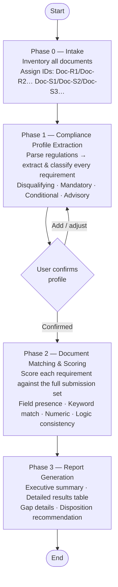

# document-validator

## Overview

`document-validator` is a document conformance agent. Given a set of **regulation documents** (the standard) and a set of **submission documents** (what was actually submitted), it systematically checks whether every requirement defined in the regulations is addressed in the submission.

The agent does not simply scan for keywords. It builds a structured compliance profile from the regulations, scores each requirement against the submission, and produces an audit report that clearly shows what is present, what is partial, and what is missing — so a reviewer can act immediately without reading every page themselves.

---

## Design Philosophy & Logic

### Phase 0 — Intake
The agent inventories all provided documents and assigns short IDs for traceability throughout the report (e.g. `Doc-R1`, `Doc-R2` for regulations; `Doc-S1`, `Doc-S2`, `Doc-S3` for submission documents). If any document is unstructured or image-based, the agent announces this and proceeds with best-effort extraction.

### Phase 1 — Compliance Profile Extraction
The agent parses all regulation documents and extracts every requirement, classifying each one by type:

| Type | Description |
|------|-------------|
| **Disqualifying** | Any failure triggers immediate return of the filing |
| **Mandatory** | Must be present and met unconditionally |
| **Conditional** | Required only when a specified trigger condition applies |
| **Advisory** | Recommended but not required; noted without scoring |

A checkpoint is presented before proceeding — the user can confirm the profile or add missing requirements.

### Phase 2 — Document Matching & Scoring
Each requirement is scored against the full submission set using the appropriate check method (field presence, keyword match, numeric/format compliance, or logical consistency). For ambiguous cases, the agent quotes the relevant passage, states its interpretation, and flags the item for manual review if needed.

Coverage scores:

| Score | Label | Meaning |
|-------|-------|---------|
| 90–100% | ✅ Compliant | Clearly addressed; content is complete |
| 70–89% | ⚠️ Partial | Present but incomplete or vague |
| 40–69% | ❌ Weak | Only indirectly related or severely insufficient |
| 0–39% | 🚫 Missing | No corresponding content found |

### Phase 3 — Report Generation
The agent produces a structured report in the language of the input documents, containing:

- **Executive summary** — overall compliance rate and disposition recommendation
- **Detailed results table** — one row per requirement, with score, source reference, and notes
- **Gap details** — for all items below 90%, consolidated by root cause with correction suggestions
- **Manual review queue** — items that require human judgment before a verdict can be issued

Disposition options: *Approve* / *Request correction* / *Return filing* / *Escalate for review*

---

## How to Use

**Step 1** — Provide your documents:

> Please validate this application package:
>
> Regulation set:
> - subsidy-program-guidelines.pdf
> - application-format-requirements.pdf
>
> Submission set:
> - application-form-main.pdf
> - attachment-1-financial-statement.pdf
> - attachment-2-project-proposal.pdf

**Step 2** — Confirm the compliance profile when prompted:

> Compliance Profile ready.
>
> Total requirements extracted: 18
> - Disqualifying: 2
> - Mandatory: 12
> - Conditional: 3
> - Advisory: 1
>
> Required attachments: financial statement, project proposal, declaration letter, consent form
>
> Does this look complete?

**Step 3** — Receive the validation report:

# Submission Validation Report

**Submission:** application-form-main.pdf (+2 attachments)
**Regulation:** subsidy-program-guidelines.pdf (+1 supporting doc)
**Review date:** 2026-06-18

---

## Executive Summary

Overall compliance rate: 72%
- ✅ Compliant: 11 items
- ⚠️ Partial: 3 items
- ❌ Weak: 1 item
- 🚫 Missing: 3 items

**Disposition: Request correction**

---

## Detailed Results

### Mandatory Requirements

| ID | Requirement | Result | Score | Source | Notes |
|----|-------------|--------|-------|--------|-------|
| REQ-1 | Applicant identity verified | ✅ | 98% | [Doc-S1] §1.1 | |
| REQ-2 | Project objectives stated | ✅ | 95% | [Doc-S1] §2.3 | |
| REQ-3 | Budget breakdown provided | ⚠️ | 74% | [Doc-S3] p.4 | Expenditure categories missing |
| REQ-4 | Financial statement attached | ✅ | 100% | [Doc-S2] | |
| REQ-7 | Declaration letter attached | 🚫 | 0% | — | Not found in any submission doc |
| REQ-8 | Consent form attached | 🚫 | 0% | — | Not found in any submission doc |

### Conditional Requirements

| ID | Requirement | Trigger applies? | Result | Score | Source | Notes |
|----|-------------|-----------------|--------|-------|--------|-------|
| REQ-14 | Co-applicant authorization letter | No | ➖ N/A | — | — | |
| REQ-15 | Environmental impact statement | Yes | ⚠️ | 78% | [Doc-S3] §5 | Summary only; full assessment not attached |

---

## Gap Details

**REQ-7, REQ-8: Declaration letter and consent form not found in any submission document**
- What is missing: Both documents are absent from the submission set
- Regulation reference: [Doc-R1] §4(2)
- Deficiency type: Correctable
- Suggested correction: Attach both documents and resubmit

**REQ-12: Project proposal does not include required budget breakdown**
- What is missing: Expenditure categories not listed
- Evidence found in: [Doc-S3] p.4 (partial)
- Regulation reference: [Doc-R2] Appendix 1
- Deficiency type: Correctable
- Suggested correction: Add a line-item budget table per [Doc-R2] Appendix 1
