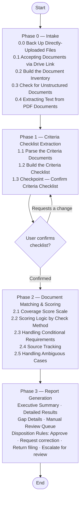

# document-validator

## Overview

`document-validator` is a document conformance agent. Given **Criteria Documents** (what defines the requirements — a regulation, a tender specification, review-committee comments, an internal checklist) and **Pending Documents** (the document(s) being checked against it — an application, a bid, a project plan), it systematically checks whether every requirement in the criteria is addressed in the pending documents.

The agent does not simply scan for keywords. It builds a structured criteria checklist from the criteria, scores each requirement against the pending documents, and produces an audit report that clearly shows what is present, what is partial, and what is missing — so a reviewer can act immediately without reading every page themselves.

---

## Design Philosophy & Logic



### Phase 0 — Intake
The agent inventories all provided documents and assigns short IDs for traceability throughout the report (e.g. `C-1`, `C-2` for the criteria documents; `P-1`, `P-2`, `P-3` for the pending documents). If any document is unstructured or image-based, the agent announces this and proceeds with best-effort extraction.

Documents that are too large to paste into chat can be provided as a Google Drive link instead (e.g. "Here is the pending document: https://drive.google.com/file/d/.../view"). The agent fetches the file using [`skill/scripts/fetch_drive_file.py`](skill/scripts/fetch_drive_file.py), which calls the Google Drive API directly — no chat-client connector required, so this also works when the skill runs as an agent deployed elsewhere (e.g. Google Agent Engine). It authenticates with Application Default Credentials, exports Google-native documents (Docs/Sheets/Slides) to PDF first so every document follows the same page-citation convention, reads plain-text/Markdown files directly into context, and expands folder links into one inventory entry per file inside. The target file must be shared with whatever identity those credentials resolve to (the deployed service account, for example) — a public "anyone with the link" share is not required and, for sensitive government filings, usually shouldn't be used.

For PDF inputs, the agent uses [`skill/scripts/extract_pdf_text.py`](skill/scripts/extract_pdf_text.py) to convert each page to Markdown — preserving page numbers for citation, rendering tables as real Markdown tables instead of jumbled text, and flagging pages that look scanned/image-based. Detected images are noted but not extracted, so a reviewer knows to check the original PDF for figures. A page that takes too long (a large embedded image) or is dense with vector graphics (a CAD/3D drawing) is flagged rather than left to stall the whole extraction. Large PDFs are pulled in page-range chunks instead of one large dump, so a 100+ page criteria document doesn't need to be loaded all at once.

### Phase 1 — Criteria Checklist Extraction
The agent parses the criteria documents and extracts every requirement, classifying each one by type:

| Type | Description |
|------|-------------|
| **Disqualifying** | Any failure triggers immediate return of the filing |
| **Mandatory** | Must be present and met unconditionally |
| **Conditional** | Required only when a specified trigger condition applies |
| **Advisory** | Recommended but not required; noted without scoring |

When the criteria have a multi-level structure (chapter → article → item), each requirement's ID mirrors that nesting with dot notation — `REQ-1`, `REQ-1.2`, `REQ-1.2.3` — so the ID alone shows where it sits in the criteria, without a separate lookup.

A checkpoint is presented before proceeding — the user can confirm the checklist or add missing requirements. If the user requests a change, the agent describes what changed and re-presents the full updated checklist for confirmation before moving on.

### Phase 2 — Document Matching & Scoring
Each requirement is scored against the full pending documents using the appropriate check method (field presence, keyword match, numeric/format compliance, or logical consistency). For ambiguous cases, the agent quotes the relevant passage, states its interpretation, and flags the item for manual review if needed.

Coverage scores:

| Score | Label | Meaning |
|-------|-------|---------|
| 90–100% | ✅ Compliant | Clearly addressed; content is complete |
| 70–89% | ⚠️ Partial | Present but incomplete or vague |
| 40–69% | ❌ Weak | Only indirectly related or severely insufficient |
| 0–39% | 🚫 Missing | No corresponding content found |

### Phase 3 — Report Generation
The agent produces a structured report in the language the user is communicating in (not necessarily the language of the input documents being analyzed), containing:

- **Executive summary** — overall compliance rate and disposition recommendation
- **Detailed results table** — one row per requirement, with score, source reference, and notes
- **Gap details** — for all items below 90%, consolidated by root cause with correction suggestions
- **Manual review queue** — items that require human judgment before a verdict can be issued

Disposition options: *Approve* / *Request correction* / *Return filing* / *Escalate for review*

---

## How to Use

**Step 1** — Describe what you're validating and provide the documents — PDFs
as a Google Drive link (or a direct upload), plain text/Markdown pasted right
into the message. The criteria don't have to be a regulation; a few example
scenarios:

### Scenario: Grant/Subsidy Application Review

> Please validate this application package:
>
> Criteria Documents:
> - subsidy-program-guidelines.pdf — https://drive.google.com/file/d/1AbCdEfGhIjKlMnOpQrStUvWxYz/view
> - application-format-requirements.md
>
> Pending Documents:
> - application-form-main.pdf — https://drive.google.com/file/d/1QwErTyUiOpAsDfGhJkLzXcVbNm/view
> - attachment-1-financial-statement.pdf — https://drive.google.com/file/d/1ZxCvBnMqWeRtYuIoPaSdFgHjKl/view
> - attachment-2-project-proposal.pdf — https://drive.google.com/file/d/1MnBvCxZaQwErTyUiOpLkJhGfDs/view

### Scenario: Tender Document Review

> Check whether this vendor's bid meets every mandatory requirement in our tender spec:
>
> Criteria Documents:
> - tender-notice.pdf — https://drive.google.com/file/d/1TenderSpecAbCdEfGhIjKlMnOp/view
>
> Pending Documents:
> - vendor-proposal.pdf — https://drive.google.com/file/d/1VendorBidAbCdEfGhIjKlMnOp/view

### Scenario: Committee Feedback Review

> Check this project proposal against the review committee's comments and the
> contractor's stated commitments — make sure everything they committed to is
> clearly reflected in the proposal.
>
> https://drive.google.com/file/d/1AbCdEfGhIjKlMnOpQrStUvWxYz/view

In every scenario, the agent inventories the documents and confirms a Criteria
Checklist with you before scoring (see Phase 1's checkpoint above).

**Step 2** — Receive the validation report, e.g. for the Grant/Subsidy scenario above:

```
# Document Validation Report

Pending document(s): application-form-main.pdf (+2 attachments)
Criteria:            subsidy-program-guidelines.pdf (+1 supporting doc)
Review date:         2026-06-18

---

## Executive Summary

Overall compliance rate: 72%
- ✅ Compliant: 11 items
- ⚠️ Partial: 3 items
- ❌ Weak: 1 item
- 🚫 Missing: 3 items

Disposition: Request correction

---

## Detailed Results

### Mandatory Requirements

| ID | Requirement | Result | Score | Source | Notes |
|----|-------------|--------|-------|--------|-------|
| REQ-1 | Applicant identity verified | ✅ | 98% | [P-1] §1.1 | |
| REQ-2 | Project objectives stated | ✅ | 95% | [P-1] §2.3 | |
| REQ-3.1.1 | Budget breakdown provided | ⚠️ | 74% | [P-3] p.4 | Expenditure categories missing |
| REQ-4.1 | Financial statement attached | ✅ | 100% | [P-2] | |
| REQ-4.2 | Declaration letter attached | 🚫 | 0% | — | Not found in any pending document |
| REQ-4.3 | Consent form attached | 🚫 | 0% | — | Not found in any pending document |

### Conditional Requirements

| ID | Requirement | Trigger applies? | Result | Score | Source | Notes |
|----|-------------|-----------------|--------|-------|--------|-------|
| REQ-5 | Environmental impact statement | Yes | ⚠️ | 78% | [P-3] §5 | Summary only; full assessment not attached |
| REQ-6 | Co-applicant authorization letter | No | ➖ N/A | — | — | |

---

## Gap Details

REQ-4.2, REQ-4.3: Declaration letter and consent form not found in any pending document
- What is missing: Both documents are absent from the pending documents
- Criteria reference: [C-1] Article 4, Items 2–3
- Deficiency type: Correctable
- Suggested correction: Attach both documents and resubmit

REQ-3.1.1: Project proposal does not include required budget breakdown
- What is missing: Expenditure categories not listed
- Evidence found in: [P-3] p.4 (partial)
- Criteria reference: [C-2] Appendix 1
- Deficiency type: Correctable
- Suggested correction: Add a line-item budget table per [C-2] Appendix 1
```

---

## Project Structure

```
document-validator/
├── agent/                  # ADK wrapper — loads skill/SKILL.md as the system prompt
│   ├── __init__.py         # Exports root_agent for the ADK loader
│   ├── agent.py            # LlmAgent construction
│   ├── skill_loader.py     # SKILL.md frontmatter parser
│   └── tools.py            # start_job/check_job (background script execution) and read_asset
├── skill/                  # The skill itself — this is what defines agent behavior
│   ├── SKILL.md            # Phases, requirement types, report format, execution guidelines
│   └── scripts/
│       ├── extract_pdf_text.py   # PDF → Markdown, launched via start_job/check_job
│       ├── fetch_drive_file.py   # Google Drive API fetch, launched via start_job/check_job
│       └── gcs_state.py          # Backs up files/state with no other durable source to GCS
├── tests/                  # Wrapper unit tests (agent construction, tool execution)
│   └── eval/                     # Behavior-level eval (see "Evaluation" below) — not pytest
│       ├── datasets/basic-dataset.json  # Eval cases — inline criteria + pending-document text
│       └── eval_config.yaml             # Custom metrics: disposition correctness, etc.
├── agents-cli-manifest.yaml  # Lets `agents-cli` (eval/dev-loop tooling) find agent/
├── deploy.sh               # Deploys to Google Cloud Agent Runtime (Agent Engine)
├── .env.example            # Copy to .env and fill in before deploying
├── requirements.txt        # Runtime dependencies, installed into the deployed container
└── pyproject.toml          # Local dev dependencies and test config
```

This repo is a complete, deployable agent: the [`agent/`](agent/) wrapper is a thin ADK loader (based on [agent-skill-wrapper](https://agentskills.io/specification)) that turns [`skill/SKILL.md`](skill/SKILL.md) into the agent's system prompt and exposes its `scripts/` as a callable tool. Nothing in `agent/` is specific to document validation — changing the agent's behavior means editing `skill/SKILL.md`, not the wrapper code.

## Evaluation

`tests/test_*.py` only checks wrapper mechanics (does `start_job` execute a script, does path traversal get rejected) — it never asserts on what the agent actually decides, since LLM output is non-deterministic and that kind of pytest assertion is flaky by nature. Whether the compliance/gap-analysis logic itself is *correct* — right disposition, right gap identified — is validated separately via [`google-agents-cli`](https://pypi.org/project/google-agents-cli/)'s eval tooling:

```bash
agents-cli eval generate   # runs the real agent over tests/eval/datasets/basic-dataset.json
agents-cli eval grade      # scores the traces against tests/eval/eval_config.yaml's metrics
```

Requires `gcloud auth application-default login` and a `GOOGLE_CLOUD_PROJECT` (pass `--project` to override) — this calls the real Gemini model. The three seeded cases cover an approve, a missing-mandatory-requirement, and a disqualifying-condition case; add more under `tests/eval/datasets/` as the skill grows. See `agents-cli eval --help` and the `google-agents-cli-eval` skill for the dataset schema, metric authoring, and the iterate-on-failures workflow.

## Deployment

**1. Configure:**

```bash
cp .env.example .env
```

Edit `.env` — at minimum set `GOOGLE_CLOUD_PROJECT` and `STAGING_BUCKET`. Bump `AGENT_MEMORY` (default `8Gi`) if criteria or pending-document PDFs run large — the container is silently OOM-killed with no error log if it runs out of memory.

**2. Deploy:**

```bash
./deploy.sh
```

This creates a local virtual environment, installs `requirements.txt`, and deploys to Google Cloud Agent Runtime (formerly Vertex AI Agent Engine). Redeploying after the first run updates the same instance (tracked via `AGENT_ENGINE_ID` in `.env`) instead of creating a new one.

**3. Register with Gemini Enterprise** (optional): follow the Reasoning Engine Resource ID printed at the end of `deploy.sh`'s output to connect it as a custom agent in the Gemini Enterprise Admin Console.

**Before deploying for real use:** the Google Drive fetch path requires the deployed service account to actually have access to the files reviewers will link to — see the Phase 0 note above. Share files with the service account's email address; "anyone with the link" is not required and usually shouldn't be used for government filings.

Agent Engine container instances are ephemeral and can be swapped between turns of the same conversation. Files saved only to local disk (a direct upload, or extraction state) don't survive that. `scripts/gcs_state.py` backs up what has no other durable source — see SKILL.md §0.0 and §1 — to a GCS bucket named `document-validator-sessions-{GOOGLE_CLOUD_PROJECT}`. Create it once and grant the deployed service account write access before deploying:

```bash
gsutil mb gs://document-validator-sessions-your-project-id
gsutil iam ch serviceAccount:your-deployed-sa@your-project-id.iam.gserviceaccount.com:roles/storage.objectAdmin gs://document-validator-sessions-your-project-id
```

### Local development

```bash
pip install -e ".[dev]"
pytest -v
```
