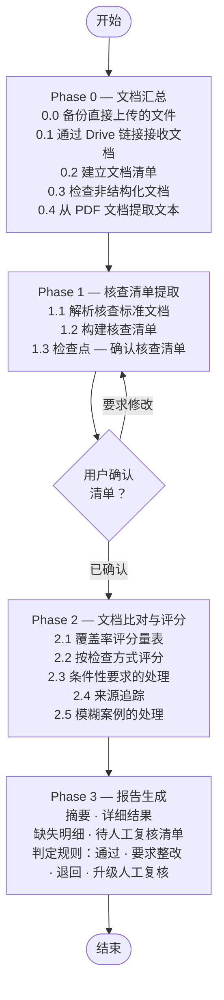

# document-validator

[English (en)](README.md) | [繁體中文 (zh-TW)](README.zh-TW.md) | [简体中文 (zh-CN)](README.zh-CN.md) | [日本語 (ja)](README.ja.md) | [한국어 (ko)](README.ko.md)

## 概览

`document-validator` 是一个文档合规核查代理（agent）。给定**核查标准文档**（定义要求的文档——可能是法规、招标规范、评审委员会意见、内部检查清单）与**待核查文档**（要被核查的文档——申请书、投标书、项目方案），它会系统地检查标准中的每一项要求是否在待核查文档中得到满足。

这个代理不只是做关键词匹配。它会从标准文档中构建结构化的核查清单，逐项对照待核查文档评分，并生成一份审核报告，清晰标示哪些条目已满足、哪些部分满足、哪些缺失——让审核人员无需逐页阅读就能立即采取行动。

---

## 设计理念与逻辑



### Phase 0 — 文档汇总
代理会清点所有提供的文档，并分配简短 ID 以便在报告中追踪（例如核查标准文档用 `C-1`、`C-2`；待核查文档用 `P-1`、`P-2`、`P-3`）。如果某个文档是非结构化或以图片为主，代理会主动告知，并尽力进行提取。

太大而无法直接粘贴到对话中的文档，可以改用 Google Drive 链接提供（例如"这是待核查文档：https://drive.google.com/file/d/.../view"）。代理会通过 [`skill/scripts/fetch_drive_file.py`](skill/scripts/fetch_drive_file.py) 直接调用 Google Drive API 获取文件——不需要聊天客户端的 connector，因此即使这个 skill 部署在其他环境（例如 Google Agent Engine）也能正常工作。它使用 Application Default Credentials 进行身份验证，会先把 Google 原生文档（Docs/Sheets/Slides）导出为 PDF，让所有文档遵循相同的页码引用规范；纯文本/Markdown 文件则直接读入内容；文件夹链接则展开为清单中每个文件各一条记录。目标文件必须分享给这组凭据所对应的身份（例如部署用的 service account）——不需要、通常也不应该对政府类文件采用"知道链接的任何人均可访问"的公开分享方式。

对于 PDF 输入，代理使用 [`skill/scripts/extract_pdf_text.py`](skill/scripts/extract_pdf_text.py) 将每一页转换为 Markdown——保留页码以便引用、将表格转换为真正的 Markdown 表格而非杂乱文本，并标记出疑似扫描/以图片为主的页面。检测到的图片会被记录但不会提取其内容，让审核人员知道需要回头查看原始 PDF 中的图表。耗时过长的页面（内嵌大图片）会超时并被标记为待人工审核。矢量图形密集的页面（CAD/3D 图）则不同：页面上的文字（标题、图说、注释）仍会正常提取，只有图形本身的视觉内容会被跳过，因为那本来就需要人工查看原始页面才能确认。大型 PDF 会按页码范围分块提取，而不是一次性读入，让超过 100 页的标准文档不需要一次性全部加载。

### Phase 1 — 核查清单提取
代理会解析核查标准文档并提取每一项要求，按类型分类：

| 类型 | 说明 |
|------|------|
| **取消资格 (Disqualifying)** | 任何一项不满足即立即退回 |
| **强制 (Mandatory)** | 必须无条件满足 |
| **条件性 (Conditional)** | 仅在特定触发条件成立时才需满足 |
| **建议性 (Advisory)** | 建议但非强制；仅记录不评分 |

当核查标准具有多层结构（章 → 条 → 项）时，每项要求的 ID 会用小数点表示这一层级——`REQ-1`、`REQ-1.2`、`REQ-1.2.3`——让人光看 ID 就能知道它在标准中的位置，不需要另外查找。

在进入下一步之前会有一个检查点——用户可以确认清单，或要求补充遗漏的要求。如果用户要求修改，代理会先说明改动了什么，再重新呈现完整的更新后清单供确认，确认后才会继续。

### Phase 2 — 文档比对与评分
每项要求会按适当的检查方式（字段是否存在、关键词匹配、数值/格式合规、逻辑一致性）对照完整的待核查文档进行评分。遇到模糊案例时，代理会引用相关段落、说明自己采用的解读方式，并在需要时将该条目标记为待人工复核。

覆盖率评分：

| 分数 | 标签 | 含义 |
|------|------|------|
| 90–100% | ✅ 符合 | 明确处理；内容完整 |
| 70–89% | ⚠️ 部分符合 | 有提及但不完整或含糊 |
| 40–69% | ❌ 薄弱 | 仅间接相关或明显不足 |
| 0–39% | 🚫 缺失 | 找不到对应内容 |
| — | 🔍 无法判定 | 唯一可用的证据是从未被实际读取的内容——图片、扫描/空白页、图纸本身的视觉内容（不是旁边的文字），或处理超时的页面 |

页面是图片、扫描或无法读取，并不代表其内容已被确认符合——这代表的是"缺乏证据"，而不是"证据存在"。代理绝不会基于没有人实际读过的内容判定为"符合"（或其他任何已评分的标签）；遇到这类情况一律评为"无法判定"，并送入待人工复核清单，明确指出审核人员需要确认什么（例如"第 9 页——图纸未提取内容；请确认其中是否包含所需的场地布局图"）。这样引用某一页需要有文字依据——图说或交叉引用（通常与未分析的图纸一起被提取出来），把那一页与这项具体要求联系起来；没有这个依据，找不到的要求就维持缺漏，不要因为文档里有不相关的图纸页就硬拉进来当理由。分数与"是否标记待人工复核"绝不会互相矛盾——一旦被标记，分数就是"无法判定"，不会是一个看起来很有把握的百分比。

### Phase 3 — 报告生成
代理会用用户当前对话所使用的语言生成结构化报告（不一定是被分析文档本身的语言），内容包括：

- **摘要** — 整体符合率与判定建议
- **详细结果表** — 每项要求各一行，含分数、来源出处与备注
- **缺失明细** — 涵盖所有低于 90% 的条目，再加上每一个"无法判定"条目，按根本原因归类并附整改建议
- **待人工复核清单** — 需要人工判断才能得出结论的条目，包括任何仅由"没有人实际读过的内容"支撑的条目

判定选项：*通过* / *要求整改* / *退回* / *升级人工复核*

---

## 如何使用

**第一步** — 说明你要核查什么，并提供文档——PDF 可使用 Google Drive 链接（或直接上传），纯文本/Markdown 可以直接粘贴在消息中。核查标准不一定要是法规；以下是几个示例场景：

### 场景：补贴/资助申请审核

> 请核查这份申请文件包：
>
> 核查标准文档：
> - subsidy-program-guidelines.pdf — https://drive.google.com/file/d/1AbCdEfGhIjKlMnOpQrStUvWxYz/view
> - application-format-requirements.md
>
> 待核查文档：
> - application-form-main.pdf — https://drive.google.com/file/d/1QwErTyUiOpAsDfGhJkLzXcVbNm/view
> - attachment-1-financial-statement.pdf — https://drive.google.com/file/d/1ZxCvBnMqWeRtYuIoPaSdFgHjKl/view
> - attachment-2-project-proposal.pdf — https://drive.google.com/file/d/1MnBvCxZaQwErTyUiOpLkJhGfDs/view

### 场景：招标文件审核

> 请检查这家供应商的投标书是否满足我们招标规范中的每一项强制要求：
>
> 核查标准文档：
> - tender-notice.pdf — https://drive.google.com/file/d/1TenderSpecAbCdEfGhIjKlMnOp/view
>
> 待核查文档：
> - vendor-proposal.pdf — https://drive.google.com/file/d/1VendorBidAbCdEfGhIjKlMnOp/view

### 场景：评审委员会意见落实核查

> 请对照评审委员会的意见和供应商承诺的事项，检查这份项目方案——确保供应商承诺的每一项都明确落实在方案中。
>
> https://drive.google.com/file/d/1AbCdEfGhIjKlMnOpQrStUvWxYz/view

在每一种场景中，代理都会先清点文档，并在开始评分前与你确认核查清单（见上方 Phase 1 的检查点）。

**第二步** — 收到核查报告，以上方补贴/资助场景为例：

> **文档核查报告**
>
> 待核查文档：application-form-main.pdf（+2 份附件）
> 核查标准：subsidy-program-guidelines.pdf（+1 份配套文档）
> 审核日期：2026-06-18
>
> **摘要**
>
> 整体符合率：72%
> - ✅ 符合：11 项
> - ⚠️ 部分符合：3 项
> - ❌ 薄弱：1 项
> - 🚫 缺失：3 项
>
> 判定：要求整改
>
> **详细结果 — 强制要求**
>
> | ID | 要求 | 结果 | 分数 | 来源 | 备注 |
> |----|------|------|------|------|------|
> | REQ-1 | 申请人身份已验证 | ✅ | 98% | [P-1] §1.1 | |
> | REQ-2 | 已陈述项目目标 | ✅ | 95% | [P-1] §2.3 | |
> | REQ-3.1.1 | 提供预算明细 | ⚠️ | 74% | [P-3] p.4 | 缺少支出类别 |
> | REQ-4.1 | 已附财务报表 | ✅ | 100% | [P-2] | |
> | REQ-4.2 | 已附声明函 | 🚫 | 0% | — | 任何待核查文档中均未找到 |
> | REQ-4.3 | 已附同意书 | 🚫 | 0% | — | 任何待核查文档中均未找到 |
>
> **详细结果 — 条件性要求**
>
> | ID | 要求 | 触发条件成立？ | 结果 | 分数 | 来源 | 备注 |
> |----|------|----------------|------|------|------|------|
> | REQ-5 | 环境影响说明 | 是 | ⚠️ | 78% | [P-3] §5 | 仅有摘要；未附完整评估 |
> | REQ-6 | 共同申请人授权书 | 否 | ➖ 不适用 | — | — | |
>
> **缺失明细**
>
> REQ-4.2、REQ-4.3：声明函与同意书在任何待核查文档中均未找到
> - 缺失内容：这两份文档都不在待核查文档中
> - 核查标准依据：[C-1] 第 4 条第 2、3 项
> - 缺陷类型：可整改
> - 整改建议：补充这两份文档后重新提交
>
> REQ-3.1.1：项目方案未包含所需的预算明细
> - 缺失内容：未列出支出类别
> - 证据出处：[P-3] p.4（部分）
> - 核查标准依据：[C-2] 附件 1
> - 缺陷类型：可整改
> - 整改建议：按 [C-2] 附件 1 补充逐项预算表

---

## 项目结构

```
document-validator/
├── agent/                  # ADK wrapper — 加载 skill/SKILL.md 作为系统提示词
│   ├── __init__.py         # 导出 root_agent 供 ADK 加载器使用
│   ├── agent.py            # LlmAgent 构建
│   ├── drive_tool.py       # fetch_drive_file_oauth — 以用户个人 OAuth 访问 Drive（仅部署环境）
│   ├── skill_loader.py     # SKILL.md frontmatter 解析器
│   └── tools.py            # start_job/check_job（后台脚本执行）与 read_asset
├── skill/                  # skill 本体 — 定义代理行为的地方
│   ├── SKILL.md            # 各阶段、要求类型、报告格式、执行准则
│   └── scripts/
│       ├── extract_pdf_text.py   # PDF → Markdown，通过 start_job/check_job 启动
│       ├── fetch_drive_file.py   # Google Drive API 获取（service account/ADC），通过 start_job/check_job 启动
│       └── gcs_state.py          # 将没有其他持久来源的文件/状态备份到 GCS
├── tests/                  # Wrapper 单元测试（代理构建、工具执行）
│   └── eval/                     # 行为层级评估（见下方"评估"）— 非 pytest
│       ├── datasets/basic-dataset.json  # 评估案例 — 内嵌的核查标准与待核查文档文本
│       └── eval_config.yaml             # 自定义指标：判定正确性等
├── agents-cli-manifest.yaml  # 让 `agents-cli`（评估/开发循环工具）能找到 agent/
├── deploy.sh               # 部署到 Google Cloud Agent Runtime（Agent Engine）
├── .env.example            # 部署前复制为 .env 并填入配置
├── requirements.txt        # 运行时依赖，会安装进部署的容器中
└── pyproject.toml          # 本地开发依赖与测试配置
```

这个 repo 是一个完整、可部署的代理：[`agent/`](agent/) wrapper 是一个很薄的 ADK 加载器（基于 [agent-skill-wrapper](https://agentskills.io/specification)），它会把 [`skill/SKILL.md`](skill/SKILL.md) 变成代理的系统提示词，并把它的 `scripts/` 暴露为可调用的工具。`agent/` 里的任何东西都不是文档核查专属的——要改变代理的行为，应该编辑 `skill/SKILL.md`，而不是 wrapper 代码。唯一的例外是 [`drive_tool.py`](agent/drive_tool.py)：它需要 ADK 的 `ToolContext` 来驱动 OAuth 同意流程，而这只存在于正规的 ADK FunctionTool 中——通过 `start_job`/`check_job` 调用的子进程脚本没有这个能力。它只在配置了 `GOOGLE_OAUTH_CLIENT_ID` 时才会被注册（见下方"部署"）；否则代理会回退使用 `fetch_drive_file.py`。

## 评估

`tests/test_*.py` 只检查 wrapper 机制（`start_job` 是否真的执行了脚本、路径穿越是否被拒绝等）——它从不对代理实际做出的判断进行断言，因为 LLM 的输出本质上是非确定性的，这类 pytest 断言天生就会不稳定。至于合规/缺失分析逻辑本身是否"正确"——判定是否正确、找出的缺失是否正确——则通过 [`google-agents-cli`](https://pypi.org/project/google-agents-cli/) 的评估工具另外验证：

```bash
agents-cli eval generate   # 在 tests/eval/datasets/basic-dataset.json 上运行真正的代理
agents-cli eval grade      # 按 tests/eval/eval_config.yaml 的指标为这些 trace 评分
```

需要 `gcloud auth application-default login` 与 `GOOGLE_CLOUD_PROJECT`（可用 `--project` 覆盖）——这会调用真正的 Gemini 模型。预先建好的三个案例涵盖通过、缺少强制要求、以及取消资格条件这三种情形；随着 skill 演进，可在 `tests/eval/datasets/` 下新增更多案例。数据集结构、指标编写方式、以及"按失败案例迭代"的工作流程，请参考 `agents-cli eval --help` 与 `google-agents-cli-eval` skill。

## 部署

**1. 配置：**

```bash
cp .env.example .env
```

编辑 `.env` — 至少要设置 `GOOGLE_CLOUD_PROJECT` 与 `STAGING_BUCKET`。如果核查标准或待核查 PDF 文件很大，请调高 `AGENT_MEMORY`（默认 `8Gi`）——容器内存不足时会被静默 OOM-killed，不会留下任何错误日志。

**2. 部署：**

```bash
./deploy.sh
# 或者不修改 .env，直接用参数覆盖 project/region：
./deploy.sh <project-id> <region>
```

这会创建一个本地虚拟环境、安装 `requirements.txt`，并部署到 Google Cloud Agent Runtime（前身为 Vertex AI Agent Engine）。第一次运行后再次部署，会更新同一个实例（通过 `.env` 中的 `AGENT_ENGINE_ID` 追踪），而不是创建一个新的。

**3. 注册到 Gemini Enterprise**（可选）：按照 `deploy.sh` 输出末尾打印的 Reasoning Engine Resource ID，在 Gemini Enterprise 管理控制台中将其连接为自定义代理。

**正式上线前须注意：** 默认的 Google Drive 获取路径，需要部署用的 service account 确实有权限访问审核人员会链接到的文件——见上方 Phase 0 的说明。请把文件分享给该 service account 的电子邮件地址；不需要、通常也不应该对政府类文件采用"知道链接的任何人均可访问"的分享方式。

**可选 — 以用户个人身份访问 Drive，取代 service account：** 在 `.env` 中设置 `GOOGLE_OAUTH_CLIENT_ID`/`GOOGLE_OAUTH_CLIENT_SECRET`（见 `.env.example`）即可启用 `agent/drive_tool.py`。配置后，代理会以通过 Gemini Enterprise 登录的用户身份访问 Drive——该用户自己的文件只需要正常分享给他即可，不需要再额外分享给 service account。请在 Google Cloud Console → APIs & Services → Credentials 中创建 OAuth 客户端（类型选"Web 应用"，启用 Drive API，同意屏幕范围设为 `drive.readonly`）。两者均留空则会跳过此功能，改用上方的 service account 路径。

Agent Engine 的容器实例是临时性的，同一段对话中的不同轮次之间可能会被替换。只存在本地磁盘的文件（直接上传的文件，或提取过程中的状态）不会在这种情况下保留下来。`scripts/gcs_state.py` 会把没有其他持久来源的内容（见 SKILL.md §0.0 与 §1）备份到名为 `document-validator-sessions-{GOOGLE_CLOUD_PROJECT}` 的 GCS bucket 中。部署前请先创建一次，并授予部署用 service account 写入权限：

```bash
gsutil mb gs://document-validator-sessions-your-project-id
gsutil iam ch serviceAccount:your-deployed-sa@your-project-id.iam.gserviceaccount.com:roles/storage.objectAdmin gs://document-validator-sessions-your-project-id
```

### 本地开发

```bash
pip install -e ".[dev]"
pytest -v
```
