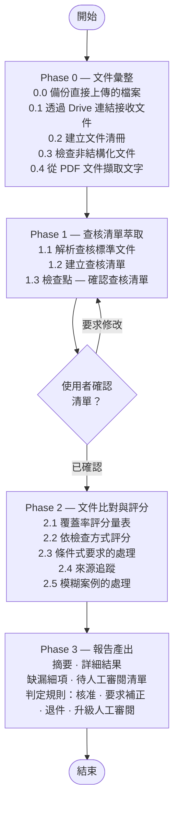

# document-validator

[English (en)](README.md) | [繁體中文 (zh-TW)](README.zh-TW.md) | [简体中文 (zh-CN)](README.zh-CN.md) | [日本語 (ja)](README.ja.md) | [한국어 (ko)](README.ko.md)

## 總覽

`document-validator` 是一個文件符合性查核代理人（agent）。給定**查核標準文件**（定義要求的文件——可能是法規、招標規範、審查委員會意見、內部檢核清單）與**待查文件**（要被查核的文件——申請書、投標書、計劃書），它會系統性地檢查查核標準中的每一項要求，是否都在待查文件中被滿足。

這個代理人不只是做關鍵字比對。它會從查核標準文件中建立結構化的查核清單，逐項對照待查文件評分，並產出一份稽核報告，清楚標示哪些項目已滿足、哪些部分滿足、哪些缺漏——讓審查者不需要逐頁閱讀就能立即採取行動。

---

## 設計理念與邏輯



### Phase 0 — 文件彙整
代理人會盤點所有提供的文件，並指派簡短 ID 以便在報告中追蹤（例如查核標準文件用 `C-1`、`C-2`；待查文件用 `P-1`、`P-2`、`P-3`）。若任何文件是非結構化或以圖片為主，代理人會主動告知，並以盡力而為的方式繼續擷取。

太大而無法直接貼入對話的文件，可以改用 Google Drive 連結提供（例如「這是待查文件：https://drive.google.com/file/d/.../view」）。代理人會透過 [`skill/scripts/fetch_drive_file.py`](skill/scripts/fetch_drive_file.py) 直接呼叫 Google Drive API 取得檔案——不需要聊天用戶端的 connector，因此即使這個 skill 是部署在其他環境（例如 Google Agent Engine）也能運作。它使用 Application Default Credentials 進行驗證，會先將 Google 原生文件（Docs/Sheets/Slides）匯出成 PDF，讓所有文件遵循相同的頁碼引用慣例，純文字/Markdown 檔案則直接讀入內容，資料夾連結則展開成清冊中每個檔案各一筆。目標檔案必須分享給這組憑證所對應的身分（例如部署用的 service account）——不需要、也通常不應該對政府文件採用「知道連結的任何人皆可存取」的公開分享方式。

對於 PDF 輸入，代理人使用 [`skill/scripts/extract_pdf_text.py`](skill/scripts/extract_pdf_text.py) 將每一頁轉成 Markdown——保留頁碼以便引用、將表格轉成真正的 Markdown 表格而非雜亂文字，並標示出疑似掃描/圖片為主的頁面。偵測到的圖片會被記錄但不會被擷取內容，讓審查者知道需要回頭查看原始 PDF 中的圖表。耗時過久的頁面（內嵌大型圖片）或向量圖形密集的頁面（CAD/3D 圖）會被標示出來，而不是讓整個擷取流程卡住。大型 PDF 會以分頁範圍區塊方式擷取,而非一次性讀入,讓超過 100 頁的查核標準文件不需要一次全部載入。

### Phase 1 — 查核清單萃取
代理人會解析查核標準文件並擷取每一項要求，依類型分類：

| 類型 | 說明 |
|------|------|
| **取消資格 (Disqualifying)** | 任何一項未滿足即立即退件 |
| **強制 (Mandatory)** | 必須無條件滿足 |
| **條件式 (Conditional)** | 僅在特定觸發條件成立時才需滿足 |
| **建議 (Advisory)** | 建議但非強制；僅記錄不評分 |

當查核標準具有多層結構（章 → 條 → 項）時，每項要求的 ID 會以小數點表示這個層級——`REQ-1`、`REQ-1.2`、`REQ-1.2.3`——讓人光看 ID 就能知道它在查核標準中的位置，不需要另外查找。

在繼續下一步之前會有一個檢查點——使用者可以確認清單，或要求補上遺漏的要求。若使用者要求修改，代理人會先說明改了什麼，再重新呈現完整的更新後清單供確認，確認後才會繼續往下走。

### Phase 2 — 文件比對與評分
每項要求會依適當的檢查方式（欄位是否存在、關鍵字比對、數值/格式合規、邏輯一致性）對照完整的待查文件進行評分。遇到模糊案例時，代理人會引用相關段落、說明自己採用的解讀方式，並在需要時標記該項目為待人工審閱。

覆蓋率評分：

| 分數 | 標籤 | 意義 |
|------|------|------|
| 90–100% | ✅ 符合 | 明確處理；內容完整 |
| 70–89% | ⚠️ 部分符合 | 有提及但不完整或含糊 |
| 40–69% | ❌ 薄弱 | 僅間接相關或明顯不足 |
| 0–39% | 🚫 缺漏 | 找不到對應內容 |
| — | 🔍 無法判定 | 唯一可用的證據是從未被實際讀取的內容（圖片、掃描頁、技術圖面，或處理逾時的頁面） |

頁面是圖片、掃描或無法讀取，並不代表其內容已被確認符合——這代表的是「缺乏證據」，不是「證據存在」。代理人絕不會根據沒有人實際讀過的內容判定為「符合」（或其他任何已評分的標籤）；遇到這類情況一律評為「無法判定」，並送入待人工審閱清單，明確指出審查者需要確認什麼（例如「第 9 頁——圖面未擷取內容；請確認其中是否包含所需的場地配置圖」）。分數與「是否標記待人工審閱」絕不會互相矛盾——一旦被標記，分數就是「無法判定」，不會是一個看起來很有信心的百分比。

### Phase 3 — 報告產出
代理人會以使用者目前對話所使用的語言產出結構化報告（不一定是被分析文件本身的語言），內容包含：

- **摘要** — 整體符合率與判定建議
- **詳細結果表** — 每項要求各一列，含分數、來源出處與備註
- **缺漏細項** — 涵蓋所有低於 90% 的項目，再加上每一個「無法判定」項目，依根本原因彙整並附補正建議
- **待人工審閱清單** — 需要人工判斷才能下結論的項目，包含任何僅由「沒有人實際讀過的內容」支撐的項目

判定選項：*核准* / *要求補正* / *退件* / *升級人工審閱*

---

## 如何使用

**第一步** — 說明你要查核什麼，並提供文件——PDF 可用 Google Drive 連結（或直接上傳），純文字/Markdown 可以直接貼在訊息中。查核標準不一定要是法規；以下是幾個範例情境：

### 情境：補助/獎助申請審查

> 請查核這份申請文件包：
>
> 查核標準文件：
> - subsidy-program-guidelines.pdf — https://drive.google.com/file/d/1AbCdEfGhIjKlMnOpQrStUvWxYz/view
> - application-format-requirements.md
>
> 待查文件：
> - application-form-main.pdf — https://drive.google.com/file/d/1QwErTyUiOpAsDfGhJkLzXcVbNm/view
> - attachment-1-financial-statement.pdf — https://drive.google.com/file/d/1ZxCvBnMqWeRtYuIoPaSdFgHjKl/view
> - attachment-2-project-proposal.pdf — https://drive.google.com/file/d/1MnBvCxZaQwErTyUiOpLkJhGfDs/view

### 情境：招標文件審查

> 請檢查這家廠商的投標書是否滿足我們招標規範中的每一項強制要求：
>
> 查核標準文件：
> - tender-notice.pdf — https://drive.google.com/file/d/1TenderSpecAbCdEfGhIjKlMnOp/view
>
> 待查文件：
> - vendor-proposal.pdf — https://drive.google.com/file/d/1VendorBidAbCdEfGhIjKlMnOp/view

### 情境：委員會意見落實審查

> 請對照審查委員會的意見和廠商承諾的事項，檢查這份計劃書——確保廠商承諾的每一項都明確落實在計劃書中。
>
> https://drive.google.com/file/d/1AbCdEfGhIjKlMnOpQrStUvWxYz/view

在每一種情境中，代理人都會先盤點文件，並在開始評分前與你確認查核清單（見上方 Phase 1 的檢查點）。

**第二步** — 收到查核報告，以上方補助/獎助情境為例：

> **文件查核報告**
>
> 待查文件：application-form-main.pdf（+2 份附件）
> 查核標準：subsidy-program-guidelines.pdf（+1 份輔助文件）
> 審查日期：2026-06-18
>
> **摘要**
>
> 整體符合率：72%
> - ✅ 符合：11 項
> - ⚠️ 部分符合：3 項
> - ❌ 薄弱：1 項
> - 🚫 缺漏：3 項
>
> 判定：要求補正
>
> **詳細結果 — 強制要求**
>
> | ID | 要求 | 結果 | 分數 | 來源 | 備註 |
> |----|------|------|------|------|------|
> | REQ-1 | 申請人身分已驗證 | ✅ | 98% | [P-1] §1.1 | |
> | REQ-2 | 已陳述專案目標 | ✅ | 95% | [P-1] §2.3 | |
> | REQ-3.1.1 | 提供預算明細 | ⚠️ | 74% | [P-3] p.4 | 缺少支出類別 |
> | REQ-4.1 | 已附財務報表 | ✅ | 100% | [P-2] | |
> | REQ-4.2 | 已附切結書 | 🚫 | 0% | — | 任何待查文件中皆未找到 |
> | REQ-4.3 | 已附同意書 | 🚫 | 0% | — | 任何待查文件中皆未找到 |
>
> **詳細結果 — 條件式要求**
>
> | ID | 要求 | 觸發條件成立？ | 結果 | 分數 | 來源 | 備註 |
> |----|------|----------------|------|------|------|------|
> | REQ-5 | 環境影響說明 | 是 | ⚠️ | 78% | [P-3] §5 | 僅有摘要；未附完整評估 |
> | REQ-6 | 共同申請人授權書 | 否 | ➖ 不適用 | — | — | |
>
> **缺漏細項**
>
> REQ-4.2、REQ-4.3：切結書與同意書在任何待查文件中皆未找到
> - 缺漏內容：這兩份文件都不在待查文件中
> - 查核標準依據：[C-1] 第 4 條第 2、3 項
> - 缺失類型：可補正
> - 建議補正方式：補附這兩份文件後重新送件
>
> REQ-3.1.1：專案計劃書未包含所需的預算明細
> - 缺漏內容：未列出支出類別
> - 證據出處：[P-3] p.4（部分）
> - 查核標準依據：[C-2] 附件 1
> - 缺失類型：可補正
> - 建議補正方式：依 [C-2] 附件 1 補上逐項預算表

---

## 專案結構

```
document-validator/
├── agent/                  # ADK wrapper — 載入 skill/SKILL.md 作為系統提示詞
│   ├── __init__.py         # 匯出 root_agent 供 ADK 載入器使用
│   ├── agent.py            # LlmAgent 建構
│   ├── drive_tool.py       # fetch_drive_file_oauth — 以使用者個人 OAuth 存取 Drive（僅部署環境）
│   ├── skill_loader.py     # SKILL.md frontmatter 解析器
│   └── tools.py            # start_job/check_job（背景腳本執行）與 read_asset
├── skill/                  # skill 本體 — 定義代理人行為的地方
│   ├── SKILL.md            # 各階段、要求類型、報告格式、執行準則
│   └── scripts/
│       ├── extract_pdf_text.py   # PDF → Markdown，透過 start_job/check_job 啟動
│       ├── fetch_drive_file.py   # Google Drive API 擷取（service account/ADC），透過 start_job/check_job 啟動
│       └── gcs_state.py          # 將沒有其他持久來源的檔案/狀態備份到 GCS
├── tests/                  # Wrapper 單元測試（代理人建構、工具執行）
│   └── eval/                     # 行為層級評估（見下方「評估」）— 非 pytest
│       ├── datasets/basic-dataset.json  # 評估案例 — 內嵌的查核標準與待查文件文字
│       └── eval_config.yaml             # 自訂指標：判定正確性等
├── agents-cli-manifest.yaml  # 讓 `agents-cli`（評估/開發迴圈工具）能找到 agent/
├── deploy.sh               # 部署到 Google Cloud Agent Runtime（Agent Engine）
├── .env.example            # 部署前複製成 .env 並填入設定
├── requirements.txt        # 執行期相依套件，會安裝進部署的容器中
└── pyproject.toml          # 本地開發相依套件與測試設定
```

這個 repo 是一個完整、可部署的代理人：[`agent/`](agent/) wrapper 是一個很薄的 ADK 載入器（基於 [agent-skill-wrapper](https://agentskills.io/specification)），它會把 [`skill/SKILL.md`](skill/SKILL.md) 變成代理人的系統提示詞，並把它的 `scripts/` 暴露成可呼叫的工具。`agent/` 裡的任何東西都不是文件查核專屬的——要改變代理人的行為，應該編輯 `skill/SKILL.md`，而不是 wrapper 程式碼。唯一的例外是 [`drive_tool.py`](agent/drive_tool.py)：它需要 ADK 的 `ToolContext` 來驅動 OAuth 同意流程，而這只存在於正規的 ADK FunctionTool 中——透過 `start_job`/`check_job` 呼叫的子行程腳本沒有這個能力。它只在設定了 `GOOGLE_OAUTH_CLIENT_ID` 時才會被註冊（見下方「部署」）；否則代理人會回退使用 `fetch_drive_file.py`。

## 評估

`tests/test_*.py` 只檢查 wrapper 機制（`start_job` 是否真的執行了腳本、路徑跳脫是否被拒絕等）——它從不對代理人實際做出的判斷做斷言，因為 LLM 的輸出本質上是非決定性的，這類 pytest 斷言天生就會不穩定。至於符合性/缺漏分析邏輯本身是否「正確」——判定是否正確、抓到的缺漏是否正確——則是透過 [`google-agents-cli`](https://pypi.org/project/google-agents-cli/) 的評估工具另外驗證：

```bash
agents-cli eval generate   # 在 tests/eval/datasets/basic-dataset.json 上執行真正的代理人
agents-cli eval grade      # 依 tests/eval/eval_config.yaml 的指標為這些 trace 評分
```

需要 `gcloud auth application-default login` 與 `GOOGLE_CLOUD_PROJECT`（可用 `--project` 覆寫）——這會呼叫真正的 Gemini 模型。預先建立的三個案例涵蓋核准、缺少強制要求、以及取消資格條件這三種情境；隨著 skill 演進，可在 `tests/eval/datasets/` 下新增更多案例。資料集結構、指標撰寫方式、以及「依失敗案例迭代」的工作流程，請參考 `agents-cli eval --help` 與 `google-agents-cli-eval` skill。

## 部署

**1. 設定：**

```bash
cp .env.example .env
```

編輯 `.env` — 至少要設定 `GOOGLE_CLOUD_PROJECT` 與 `STAGING_BUCKET`。若查核標準或待查 PDF 檔案很大，請調高 `AGENT_MEMORY`（預設 `8Gi`）——容器記憶體不足時會被靜默 OOM-killed，不會留下任何錯誤訊息。

**2. 部署：**

```bash
./deploy.sh
# 或是不修改 .env，直接用參數覆寫 project/region：
./deploy.sh <project-id> <region>
```

這會建立一個本地虛擬環境、安裝 `requirements.txt`，並部署到 Google Cloud Agent Runtime（前身為 Vertex AI Agent Engine）。第一次執行後再次部署，會更新同一個執行個體（透過 `.env` 中的 `AGENT_ENGINE_ID` 追蹤），而不是建立一個新的。

**3. 註冊到 Gemini Enterprise**（選用）：依照 `deploy.sh` 輸出結尾印出的 Reasoning Engine Resource ID，在 Gemini Enterprise 管理控制台中將它連接為自訂代理人。

**正式上線前須注意：** 預設的 Google Drive 擷取路徑，需要部署用的 service account 確實有權限存取審查者會連結到的檔案——見上方 Phase 0 的說明。請把檔案分享給該 service account 的電子郵件地址；不需要、也通常不應該對政府文件採用「知道連結的任何人皆可存取」的分享方式。

**選用 — 以使用者個人身分存取 Drive，取代 service account：** 在 `.env` 中設定 `GOOGLE_OAUTH_CLIENT_ID`/`GOOGLE_OAUTH_CLIENT_SECRET`（見 `.env.example`）即可啟用 `agent/drive_tool.py`。設定後，代理人會以透過 Gemini Enterprise 登入的使用者身分存取 Drive——該使用者自己的檔案只需要正常分享給他即可，不需要再額外分享給 service account。請在 Google Cloud Console → APIs & Services → Credentials 中建立 OAuth 用戶端（類型選「網頁應用程式」，啟用 Drive API，同意畫面範圍設為 `drive.readonly`）。兩者皆留空則會跳過此功能，改用上方的 service account 路徑。

Agent Engine 的容器執行個體是暫時性的，同一段對話中的不同回合之間可能會被替換。只存在本機磁碟的檔案（直接上傳的檔案，或擷取過程中的狀態）並不會在這種情況下保存下來。`scripts/gcs_state.py` 會把沒有其他持久來源的內容（見 SKILL.md §0.0 與 §1）備份到名為 `document-validator-sessions-{GOOGLE_CLOUD_PROJECT}` 的 GCS bucket 中。部署前請先建立一次，並授予部署用 service account 寫入權限：

```bash
gsutil mb gs://document-validator-sessions-your-project-id
gsutil iam ch serviceAccount:your-deployed-sa@your-project-id.iam.gserviceaccount.com:roles/storage.objectAdmin gs://document-validator-sessions-your-project-id
```

### 本地開發

```bash
pip install -e ".[dev]"
pytest -v
```
